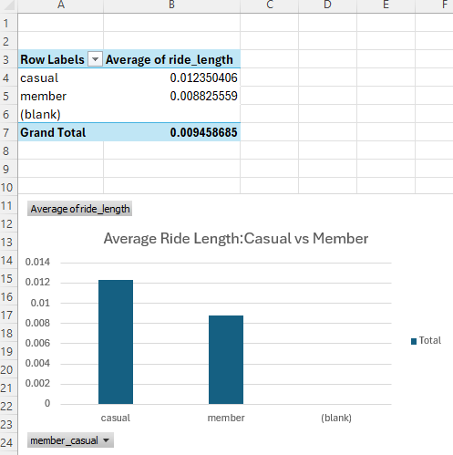
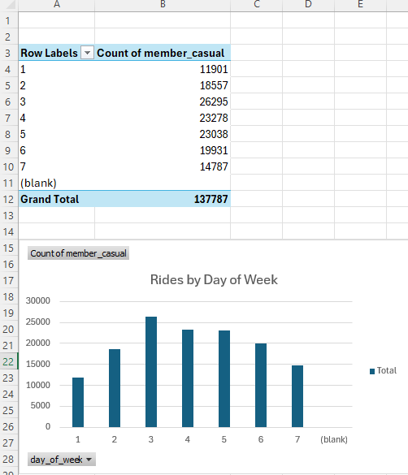

# Cyclistic Bike Share Analysis

**Google Data Analytics Professional Certificate | Capstone Project**

**Tools:** Excel (pivot tables, calculated columns, charts)

## Project Overview

Cyclistic is a Chicago bike share company with two rider types: casual riders who pay per ride, and annual members who pay a subscription. Annual members are far more profitable.

The business question: **how do casual riders and annual members use Cyclistic bikes differently?** The answer drives a marketing strategy to convert casual riders into members.

Analyzed **137,787 real bike share rides** to find behavioral differences between the two groups.

## Business Questions Answered

1. How do casual riders and members differ in ride duration?
2. Which days of the week does each group ride?
3. Where should marketing spend go to convert casual riders into members?

## Key Findings

**Casual riders ride longer, members ride more often.**

* Casual riders average **18 minutes** per ride
* Annual members average **12.7 minutes** per ride
* Casual riders take rides roughly **42% longer** than members

**Ride volume is not evenly distributed across the week.**

Total rides by day across 137,787 rides:

* Day 1: 11,901
* Day 2: 18,557
* Day 3: 26,295
* Day 4: 23,278
* Day 5: 23,038
* Day 6: 19,931
* Day 7: 14,787

Midweek carries peak volume. Day 3 alone accounts for 19% of all rides, more than double the lowest day.

**What this means:** the two groups are not using the same product. Members use Cyclistic as commuter infrastructure, short trips, high frequency. Casual riders use it as recreation, longer trips, lower frequency. A single marketing message will not reach both.

## Business Recommendations

1. **Target casual riders on the days they actually ride.** Marketing spend concentrated on peak volume days puts the message in front of casual riders while they are already using the product, not days later in an email.

2. **Sell the membership on cost, not convenience.** Casual riders take longer rides, which means they pay more per trip under pay-as-you-go pricing. The pitch writes itself: show a casual rider what their last 10 rides would have cost on a membership. That is a number, not a slogan.

3. **Build a mid tier product.** The gap between a per-ride casual user and a full annual member is large. A weekend or seasonal pass captures recreational riders who will never commute daily but ride enough to be worth converting.

## Method

* Cleaned and standardized 137,787 ride records in Excel
* Built calculated columns for `ride_length` (ended_at minus started_at) and `day_of_week`
* Removed invalid records with negative or zero ride duration
* Built pivot tables aggregating ride count and average duration by rider type and day of week
* Visualized results with charts to compare casual vs member behavior

## Charts

## Dataset

Divvy trip data (Chicago), 12 months of public bike share records, 137,787 rides after cleaning.

## Next Steps

* Segment ride duration by day of week to find when the casual vs member gap is widest
* Analyze start and end station data to identify recreational vs commuter routes
* Model conversion rate lift from a weekend pass product

## Author

**Yousif Khazmi** | Data Analyst
Google Data Analytics Professional Certificate (Credential ID: OX1IO1AQAGRY)
